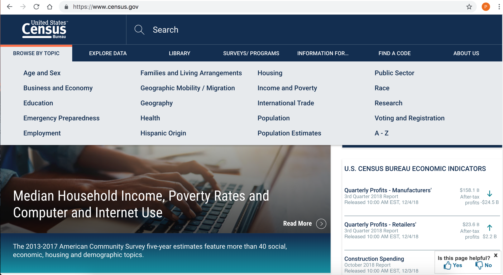
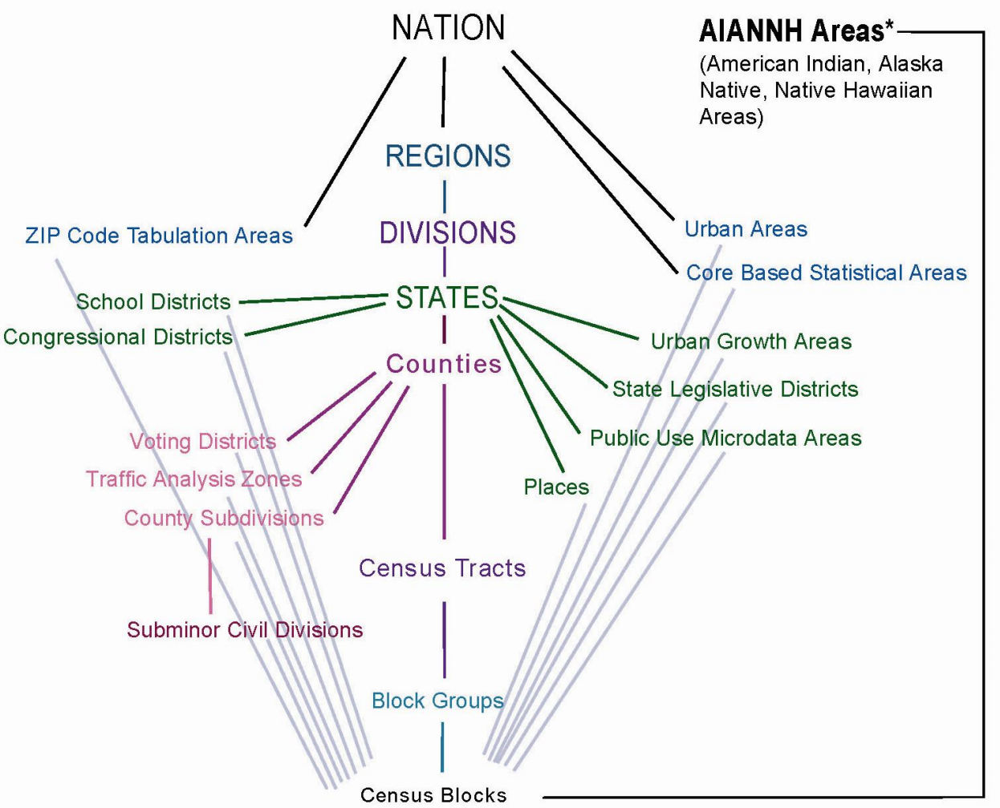
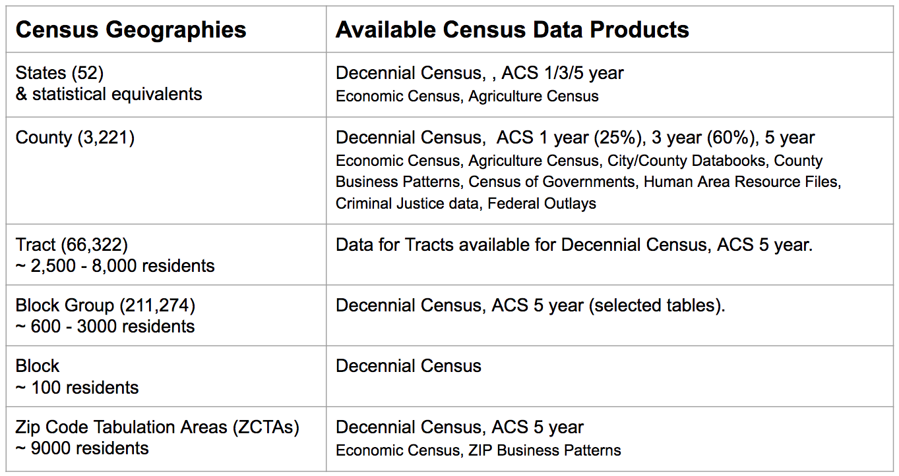
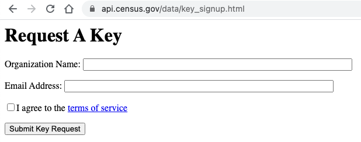
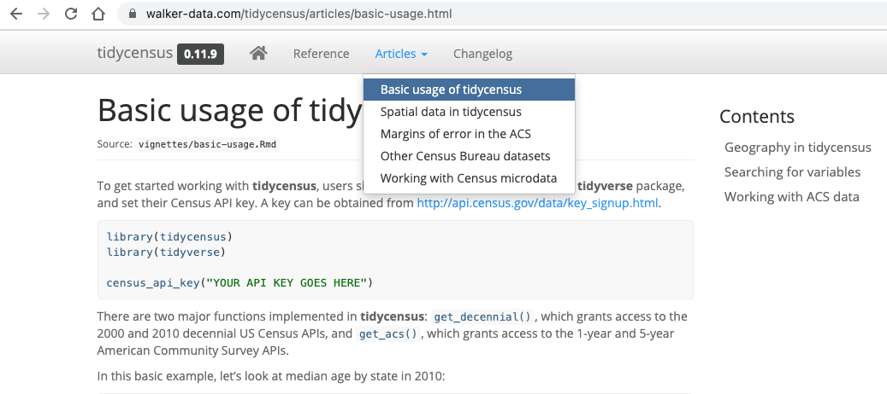
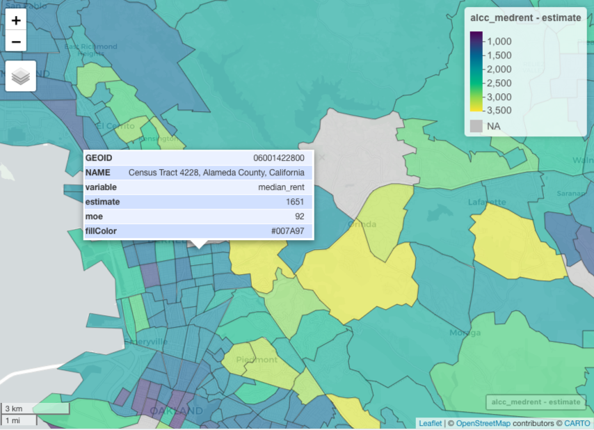
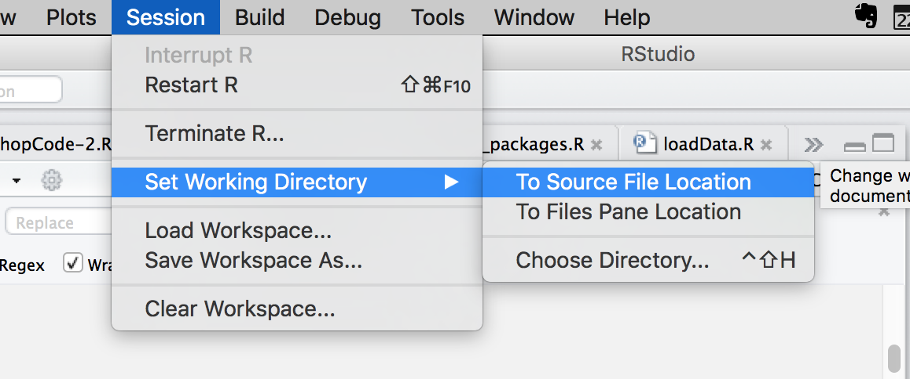

```{r setup, include=FALSE}
knitr::opts_chunk$set(echo = TRUE)

```

# Getting Started

## Setup

Welcome! While we're waiting:

* **Clone or download** the workshop files from [https://github.com/dlab-berkeley/Census-Data-in-R](https://github.com/dlab-berkeley/Census-Data-in-R)
    - If you downloaded the zipfile, **unzip it**.
    - Make a note of the folder in which the files reside. 
    
    
* Open **RStudio**

* Open a new **R script** file

## Introduction

- About me

- About you
    - Your familiarity with US Census data
    - With geospatial data
    - With geospatial data in R

## Outline

- Describe primary US Census data products

- Introduce R packages for working with census data

- Use those packages to fetch census data

- Use those packages to fetch census data plus census geographic boundary files

- Make maps of census data

# Census Data Overview

## US Census Data

The "nation's leading provider of quality data about its people and economy."

</img>

Available at [www.census.gov](www.census.gov)

## Primary Census Products

- Decennial Census

- American Community Survey (ACS)

## Decennial Census

Complete count of the population every 10 years since 1790 

Includes data on 

- Population, by age and race/ethnicity 

- Housing, by occupancy and tenure (owned, rented)

From 1840 to 2000, additional questions were asked of a sample of the population.

- See [https://www.census.gov/history/www/through_the_decades/index_of_questions/](https://www.census.gov/history/www/through_the_decades/index_of_questions/)

Since 2005 those sample questions now comprise the American Community Survey (ACS).

## American Community Survey (ACS)

- Annual survey of a sample of about 3.5 million households

- Provides estimates of demographic, social, economic, and housing characteristics

- Includes margin of error values for the estimates

 
## Decennial Census* versus ACS Data
| Demographic*    | Social             | Economic          | Housing           |
|-----------------|--------------------|-------------------|-------------------|
| Sex             | Families           | Income            | Tenure*           |
| Age             | Education          | Benefits          | Occupancy*        |
| Race            | Marital Status     | Employment Status | Structure Type    |
| Hispanic Origin | Fertility          | Occupation        | Housing Value     |
|                 | Grandparents       | Industry          | Taxes & Insurance |
|                 | Veterans           | Commuting         | Utilities         |
|                 | Disability Status  | Place of Work     | Mortgage          |
|                 | Language at Home   | Health Insurance  | Monthly Rent      |
|                 | Citizenship        |                   |                   |
|                 | Mobility           |                   |                   |


## Census Geographies

</img>

Census microdata (data collected from individuals) are publicly available at one or more levels of geographic aggregation. Not all data tables are available all geographies, e.g., only decennial census data are available at the block level.


## Census Data and Census Geographies

</img>

## ACS Data Products

ACS 1-year and 5-year products are currently available through 2019

- New data is released at the end of the next year (2020 data in 2021)

ACS 3-year no longer available (2008—2013)

ACS 5-year data provides much better estimates, lower margins of error

- More data tables are available for ACS 5-year product

See: [Census ACS: Guidance for Data Users](https://www.census.gov/programs-surveys/acs/guidance.html)


## Census Data Workflow

Identify your 

- Topic of interest
- Dataset: Decennial Census or ACS?
- Year(s)
- Tabulation unit of aggregation (county, tract, etc.)
- Geographic filter: For what specific locations?

Then determine what specific tables and variables
are available.

## CAUTION

"If you want to measure change you can't change the measures!"

**Census tables, variables, geographies, and geographic boundaries change over time!**

Measuring change over time with census data is *its own thing*, complex, and not covered by this workshop!

## Accessing Census Data

You can download census data directly from:

- [data.census.gov](https://data.census.gov/cedsci) or 
- [NHGIS.org](https://www.nhgis.org/)
- [Social Explorer](https://www.socialexplorer.com/)
    - Subscription service but FREE for UCB community

You can download Census `geographic data` directly on the [census website](https://www.census.gov/geographies/mapping-files.2019.html) or from NHGIS.

## Census APIs

You can write code to fetch data from the [Census Web APIs](https://www.census.gov/data/developers/data-sets.html)

- API: application programming interface

- Web API: URLs can be formatted to make queries that return data

Or you can leverage an existing R package to make this easier!

- That's what we will do!

*Only a subset of recent Census data products are available via APIs.*

# R Packages for Working with Census Data

## R Packages for Working with Census Data

These are the ones we recommend and will use today.

- [tidycensus](https://walkerke.github.io/tidycensus) and [tigris](https://github.com/walkerke/tigris)

- [tidyverse](https://www.tidyverse.org/)
   
- [sf](https://r-spatial.github.io/sf/)

- [mapview](https://r-spatial.github.io/mapview/)


# `tidycensus` and `tigris`

## [tidycensus](https://walkerke.github.io/tidycensus)

An R package with functions that make it easier to fetch decennial census and ACS data from the Census APIs.

- Limited available from Census

  - Decennial census: 1990, 2000, and 2010
  - ACS 1 yr: 2005 through 2019
  - ACS 5 yr: 2005—2009 through 2015—2019 are available. 
    - Note: `tidycensus` refers to ACS 5 year datasets by the endyear, e.g., 2009 or 2019.
    - Latest available year is the default year for `tidycensus` functions

- Actively maintained and expanding to include more census data products (see `tidycensus` website)


## Requesting a Census API key

`tidycensus` requires you to first get a `Census API key`. 

 - Get one now if you don't have one yet!
 - (https://api.census.gov/data/key_signup.html)
 
 <p>&nbsp;</p>

</img>
 

##  [tigris](https://github.com/walkerke/tigris)

Provides access to Census geographic data files

- detailed TIGER/Line boundary files or
- simplified **cartographic** boundary files (default)
    
Also provides access to additional geographic data,

- e.g., rivers, roads, coastlands, landmarks, and more!

Used by `tidycensus` to access state, county, tract, block group, block, and ZCTA boundaries.

    
## `tidycensus` and `tigris`

Packages developed by [Kyle Walker](https://walkerke.github.io/) to make it easier to fetch data from Census websites and APIs in **R** and get that data in a useable format to analyze, plot, and map.

Check out his website to keep abreast of his great packages, blog posts, and tutorials.

- http://personal.tcu.edu/kylewalker/

- https://walkerke.github.io/

Walker also develped a new [DataCamp](https://www.datacamp.com) course: [Analyzing US Census Data in R!](https://www.datacamp.com/courses/analyzing-us-census-data-in-r)

- Highly recommended! First chapter free!

## [tidycensus tutorials](https://walker-data.com/tidycensus/articles/basic-usage.html)

</img>


## [tidyverse](https://www.tidyverse.org/)

A collection of R packages for data science, developed primarily by [Hadley Wickham](http://hadley.nz/), Chief Scientist at [RStudio](https://www.rstudio.com/), including:

 - `dplyr` and `tidyr` for reshaping data

 - `ggplot2` for plotting

 - `purr`, `readr`, and `tibble` for improved performance 

These packages *and more* are used by `tidyverse` under the hood.

## [sf](https://r-spatial.github.io/sf/) package

`Simple features` for geospatial data objects and methods.

- Next generation R package for working with vector geospatial data
    - supercedes the `sp` package
    
`sf` includes the functionality of the `sp`, `rgdal`, `rgeos`, and `proj4` packages.

- but with improved performance, simplified command syntax, and easier workflows.

`sf` is loaded and used automatically by `tidycensus`.

## [mapview](https://r-spatial.github.io/mapview/)

`mapview` provides functions for quickly and easily create interactive mapping visualizations.

</img>

# Tutorial Time!

## Part 1

We will work through several exercises using `tidycensus` to fetch, wrangle, and map census data.

## Install packages

Install any packages we will use that are not installed already. If you installed any of these awhile ago it's a good idea to install updates!

```{r, eval=F}
# A list of the packages we will use
list_of_packages <- c("tidyverse","tidycensus","tigris","sf","mapview")

# identify the ones we need to install
new_packages <- list_of_packages[!(list_of_packages %in% installed.packages()[,"Package"])]

# install any that are not installed (new_packages)
if(length(new_packages) > 0) {
  print(paste("Installing these packages:", new_packages))
  install.packages(new_packages)
} else {
  print("All packages already installed!")
}
```

## Loading packages

Load the packages we will use today

```{r, message=FALSE, warning=FALSE}
library(tidycensus)
library(tidyverse) 
library(tigris)
library(sf)
library(mapview)
```

If you are getting errors try importing dplyr or reinstalling dplyr package as that has worked for some.


## Census API Key

You need a Census API key to programmatically fetch census data.

Get it here (pretty quick):

* (https://api.census.gov/data/key_signup.html)

For more info see:

* https://www.census.gov/data/developers/data-sets.html

## Install Your Census API Key

Use the tidycensus function **census_api_key** to register your API key with tidycensus

```{r, eval=F}
# Install your census api key - long alphanumeric string
census_api_key("THE_BIG_LONG_ALPHANUMERIC_API_KEY_YOU_GOT_FROM_CENSUS")
```

## Install your Census API Key

I keep my key in a file so no one can see it
```{r}

# # source (run) an r script that creates a variable with my key
# source("/Users/pattyf/Documents/Dlab/
#         workshops/keys/census_api_key.R")
source("/Users/kathe/berkeley_drive/analyses/keys/census_api_key.R")

# register the key
census_api_key(key = my_census_api_key, 
               install = FALSE, 
               overwrite = FALSE)

```

## Set working directory

Be sure to **clone or downloaded and unzip** the workshop files from: [https://github.com/dlab-berkeley/Census-Data-in-R](https://github.com/dlab-berkeley/Census-Data-in-R)

Then set your working directory to the repo folder, e.g.,

* `setwd("~/Documents/Dlab/workshops/2021/Census-Data-in-R")`

**OR**

</img>

# Fetching Decennial Census Data

## Population Data

Let's start by fetching **population data** from the 2010 Census **for all states**.

In order to fetch census data you need to identify the census **variables** that contain the data of interest.

## Topics, Tables, and Variables

Census data **variables** are organized in **tables**, which are organized by **topic** or concept.

The tidycensus **load_variables** function can help with this step.

First, take a look at the function documentation.
```{r, eval=F}
?load_variables
```

## load_variables

Use `load_variables` to fetch all variables used in the 2010 census into a dataframe.
```{r}
vars2010 <- load_variables(year=2010,        # Year or end year for ACS-5yr
                           dataset = 'sf1',  # 'sf1' for decennial or 'acs5', etc
                           cache = TRUE)     # Whether to save fetched data locally
```

## Decennial Census Variables

Let's take a look at and discuss the resultant dataframe.
```{r, eval=F}
View(vars2010)
```

## 2010 Decennial Census Tables

- Topics: Population, housing

- `3,346` Variables: 3,346

- `333` Tables - *that's a lot*!
    - 177 population tables (identified with a ‘‘P’’) available to the block level 
    - 58 housing tables (identified with an ‘‘H’’) available to the block level
    - 82 population tables (identified with a ‘‘PCT’’) available to the census tract level
    - 4 housing tables (identified with an “HCT”) available to the census tract level
    - 10 population tables (identified with a “PCO”) available to the county level 
    - plus 2 additional PCT tables

<small>https://www.census.gov/data/datasets/2010/dec/summary-file-1.html</small>

## What Variable Has the 2010 Total Population value? 

We can sort and filter the vars2010 dataframe to find it.

</img>

## get_decennial

We can use the tidycensus function **get_decennial** to fetch the 2010 census data for total population by state.

First, check the documentation for the function.
```{r, eval=F}
?get_decennial
```

## get_decennial

Fetch total population by state (**P001001**) from the 2010 census using `get_decennial`.

```{r}

pop2010 <- get_decennial(geography = "state",   # census tabulation unit
                         variables = "P001001", # variable(s) of interest
                         year = 2010)           # census year
          
```

## View the Data

- How many rows and columns? 

- Do you see the expected number of states?

- What column contains the population counts?

- Do the data values see to be right?
```{r, eval=F}
head(pop2010)
tail(pop2010)
```

##
```{r}
head(pop2010)
tail(pop2010)
```

## Visualize Results

We can visualize the data to get a quick overview of the distribution of data values.

It's a first step in exploratory data analysis and a last step in data communication.

`ggplot2` is the most commonly used R package for data visualization. 

- It is loaded when you load the `tidyverse` package.

Let's use it to visualize the population data.

## Plot 2010 Population by state

Use `ggplot2` to create an ordered horizontal bar chart.
```{r}
pop_plot<- ggplot(data=pop2010, aes(x=reorder(NAME,value), y=value/1000000)) + 
  geom_bar(stat="identity") + coord_flip() +
  theme_minimal() + 
  labs(title = "2010 US Population by State") +
  xlab("State") +
  ylab("in millions")
```

## Display the Plot

```{r, echo=F}
pop_plot
```

## Challenge

Fetch total population data by state from the 2000 decennial census.

*Don't assume variable names are the same across years.* 

Check first by loading the 2000 variables into a dataframe.

## Challenge Solution

Total Population in 2000

```{r, eval = F, code_folding = "hide"}
# What is the variable name in 2000?
vars2000 <- load_variables(year=2000, dataset = 'sf1', cache = T)

# Take a look and search in the dataframe
View(vars2000)

# Fetch the 2000 pop data
pop2000 <- get_decennial(geography = "state", variables = "P001001", year = 2000)

# Take a look  
View(pop2000)
```

## Limiting by Area of Interest

In the previous example we retrieved population data for all states.

- This is the default behavior if you don't specify a subset.

- But you can limit the data to be retrieved by subunits like state.

## Limit Areas of Interest

Let's fetch data for just 3 states.

```{r}
state_pop2010 <- get_decennial(geography = "state", # census tabulation unit
                         variables = "P001001",     # variables of interest
                         year = 2010,               # census year
                         state=c("CA","OR","WA"))   # Filter by states of interest

```

*Note we are referencing states by their abbreviation.*

## View Results
```{r}
state_pop2010
```

## Changing Census Tabulation unit

`get_decennial` accepts a number of different values for **tabulation unit**.

- Options include: `state`, `county`, `tract`, `block group`, `block`, and `ZCTA`.

Let's change the tabulation unit from `state` to `county`.
```{r}
county_pop2010 <- get_decennial(geography = "county", # census tabulation unit
                            variables = "P001001",    # variable(s) of interest
                            year = 2010)              # data year - only one!
```

## Changing Census Tabulation Unit

View the county data to see what was retrieved.
```{r, eval=F}
View(county_pop2010)
```

## Challenge 

* Fetch population by **county** for Oregon and California

*Try it before you look ahead at solutions.*

## Challenge Solution
```{r}

## Fetch population by **county** for Oregon and California
county_pop2010_ca_and_or <- get_decennial(geography = "county",   # census tabulation unit
                                 variables = "P001001",  # variables of interest
                                 year = 2010,
                                 state=c('CA','OR'))

#head(county_pop2010_ca_and_or)

```

## Census Tract Data

Census tracts are the most commonly used census tabulation unit.

Let's fetch population data for the census tabulation unit to *tract*

## Census Tract Data

Fetch total population for all states by census tract

```{r, eval=F}
## Fetch population by **tract** for all states.
pop2010_tracts <- get_decennial(geography = "tract",    # census tabulation unit
                                variables = "P001001",  # variables of interest
                                year = 2010)

```

## Census Tract Data

Fetch total population for California by census tract

```{r, eval=F}
## Fetch population by **tract** for California.
cal_pop2010_tracts <- get_decennial(geography = "tract",       # census tabulation unit
                                       variables = "P001001",  # variables of interest
                                       year = 2010,
                                       state=c('CA'))      # State filter

```


## Fetching Census Tract Data

If you want census data at the tract level or below you **must** specifiy the state(s)

- You can also specify one or more counties
```{r,}
tract_pop2010 <- get_decennial(geography = "tract",   # census tabulation unit
                         variables = "P001001",       # variable of interest
                         year = 2010,                 # census year - only one!
                         state="CA",                  # limit to California
                         county=c("Alameda","Contra Costa"))  # & these counties
```

## Fetching Census Tract Data

View the results! How many census tracts are in these 3 counties?

```{r, eval=F}
dim(tract_pop2010)
View(tract_pop2010)
```

## Using FIPS Codes

You can use names, abbreviations, or FIPS codes for your `state` and `county`.

```{r, eval=F}
# County FIPS Codes for
# Alameda, SF, Contra Costa, Marin County, Napa, 
# San Mateo, Santa Clara,  Solano,  Sonoma, santa cruz
nine_counties <- c("001", "075", "013", "041", "055", "081", "085", "095", "097")

# Fetch population by **tract** for the nine county Bay Area
bayarea_pop2010_tract <- get_decennial(geography = "tract",   # census tabulation unit
                         variables = "P001001",       # variable of interest
                         year = 2010,                 # census year
                         state="CA",                  # limit to state of California
                         county=nine_counties)  # and only these counties
# View results
# View(bayarea_pop2010_tract)
```


# Any QUESTIONS


## Fetching data for more than one census variable

What **three** things are new here?
```{r}
#urban and rural pop for 3 CA counties
ur_pop10 <- get_decennial(geography = "county",  # census tabulation unit
                           variables = c(urban="P002002",rural="P002005"),
                           year = 2010, 
                           summary_var = "P002001",  # The denominator
                           state='CA',
                           county=c("Napa","Sonoma","Mendocino"))

```

## Fetching data for more than one census variable

1. You can specify more than one variable:
```
variables = c("P002002","P002005")
```

2. You can rename the values in the output 'variable' column.
```
variables = c(urban="P002002",rural="P002005")
```

3. You can identify a `summary_var` (a denominator - here, the total count of all people or households surveyed. Can be used for calculations like percent of total.) 
```
summary_var = "P002001"
```

## Take a look at the results
```{r}
ur_pop10
```

## Calculating Percents

The `summary_value` column comes in handy when you want to compute percent of total, for example:

```{r}
# Calculate the percent of population that is Urban or Rural
ur_pop10 <- ur_pop10 %>%
            mutate(pct = 100 * (value / summary_value))

```

## Calculating Percents

Let's take a look at the output.
```{r}
ur_pop10 # Take a look
```

## Plot it

Plots give us compact visual summaries of the data.
```{r}
myplot <- ggplot(data = ur_pop10, 
          mapping = aes(x = NAME, fill = variable, 
                     y = ifelse(test = variable == "urban", 
                                yes = -pct, no = pct))) +
          geom_bar(stat = "identity") +
          scale_y_continuous(labels = abs, limits=c(-100,100)) +
          labs(title="Urban & Rural Population in Wine Country", 
               x="County", y = " Percent of Population", fill="") +
          coord_flip()
```
*Don't worry if you don't get all the ggplot code now. It's here for reference.*

## Plot it
```{r}
myplot
```

## Fetch all the data in one table

This is often helpful **but** you need to keep tract of the meaning of each variable.

- You can go back to the vars2010 and filter by the table id to check:
```{r}
alco_pop10 <- get_decennial(geography = "tract", # Census tabulation unit
                           table =  "P002",      # Table of urban & rural population counts
                           year = 2010,          # Decennial census year
                           state='CA',           # Filter state
                           county="Alameda")     # Filter county

```

## Take a look
```{r}
unique(alco_pop10$variable) # What and how many unique vars in table?

head(alco_pop10,3)  # Take a look at output
```


## Output Options

Let's try all three of these commands and then look at the ouput to see what's different?

```{r, eval=F}
get_decennial(geography = "state", variables = "P001001",
              year = 2010)

get_decennial(geography = "state", variables = c(pop10="P001001"),
              year = 2010)

get_decennial(geography = "state", variables = c(pop10="P001001"),
              year = 2010, output="wide")
```


## Data Wrangling

Your R skills can help you reformat the data and make it more usable.

Let's fetch population data for 2010 and 2000 by state with **output=wide**.

- We will label the variables **pop00** and **pop10**.

Then we will combine these into one data frame.

## Data Wrangling

Fetch pop by state from both the 2000 and 2010 census
```{r}
pop2000 <- get_decennial(geography = "state",
                         variables = c(pop00="P001001"), 
                         year = 2000, output="wide")

pop2010 <- get_decennial(geography = "state",
                         variables = c(pop10="P001001"), 
                         year = 2010, output="wide")

```

## Take a look at the output

What column(s) can we use to merge these two dataframes?

```{r}

head(pop2000, 3)

head(pop2010, 3)

```
## Merge population by state from both censuses

Save in a new dataframe with both columns
```{r}
pop2000_2010 <- pop2000 %>% merge(pop2010, by="NAME") %>%
                             select(NAME, pop00, pop10)

head(pop2000_2010,3)
```

## Save the data

Use `write.csv` to save a data frame to a `CSV` file.

```{r, eval=F}
write.csv(pop2000_2010, file="data_out/pop2000_2010.csv", row.names = FALSE)
```

# Any QUESTIONS?


# Part 2. Mapping


## Mapping Census Data with `tidycensus`

You can fetch geographic data by adding the parameter **geometry=TRUE** to `tidycensus` functions

- Under the hood, tidycensus calls the `tigris` package to fetch data from the Census Geographic Data APIs.

- Only a subset of data available via `tigris` can be accessed via `tidycensus`.

You can then use your favorite mapping functions or libraries like `plot`, `ggplot`, and `tmap` to make maps.

## Geometry Options

Before fetching census geographic data, we need to set the option `tigris_use_cache` to TRUE

Caching greatly speeds things up if you fetch the same census geographic data repeatedly.

```{r}
# Tigris options - used by tidycensus
# Cache retrieved geographic data locally
options(tigris_use_cache = TRUE)  
```


## Fetch Geographic Boundary Data with `tidycensus`

We fetch the geospatial data by setting **geometry=TRUE**.

```{r}
pop2010geo <- get_decennial(geography = "state", 
                          variables = c(pop10="P001001"), 
                          year = 2010, 
                          output="wide", 
                          geometry=TRUE) # Fetch geometry with the data for mapping
 
```

## Take a look

Let's take a minute to discuss the format of an `sf` spatial object.
```{r}
head(pop2010geo, 3)
```


## Geospatial Data in R

R `sf` objects include

- a dataframe with a `geometry` column named of `geometry`

    - The geometry can be of type POINT, LINE, POLYGON
    - or, MULTIPOINT, MULTILINE or MULTIPOLGYON

- a `CRS` (coordinate reference system), specified by
    - epsg(SRID) code
    - proj4string
    
For a deeper understanding of the `sf` package and its functionality, we recommend our [Geospatial-Fundamentals-in-R-with-sf](https://github.com/dlab-berkeley/Geospatial-Fundamentals-in-R-with-sf) workshop.
    
## Census Data Coordinate Reference System (CRS)

All census geographic data use the `NAD83` CRS, or coordinate reference system. `NAD83` stands for North American Datum of 1983. The geographic coordinates are longitude and latitude values encoded as decimal degrees.

`WGS84`, or [The World Geodetic System of 1984](https://en.wikipedia.org/wiki/World_Geodetic_System) is the most commonly used geographic CRS. The difference between points in these systems varies up to 1 meter in continental US.

Many geospatial operations require you transform data to a common CRS before conducting spatial analysis or mapping.  

An in-depth discussion of CRSs is outside the scope of this workshop. See [Geocomputation in R](https://geocompr.robinlovelace.net/reproj-geo-data.html) for more information.

## Mapping `sf` Spatial Objects

We can use `plot` to make a quick map the geometry stored in an `sf` spatial object.

```{r}
plot(pop2010geo$geometry)
```

## Question

What do you get if you plot the `sf` object without specifying "$geometry"

Try it!
```{r, eval=F}
plot(pop2010geo)
```

## The Challenge of US maps

The vast geographic extent and non-contiguous nature of the USA makes it difficult to map.

```{r, echo=F}
plot(pop2010geo$geometry) #view again
```

## Fetch Geographic Data with `tidycensus`, SHIFTED

tidycensus includes a `shift_geo` parameter to shift AK & HI to below Texas.
```{r}

pop2010geo_shifted <- get_decennial(geography = "state", 
                                    variables = c(pop10="P001001"), 
                                    output="wide",
                                    year = 2010, 
                                    geometry=TRUE, 
                                    shift_geo=TRUE)

```

## Shift Happens!
```{r}
plot(pop2010geo_shifted$geometry)
```

## Save it

You can save any `sf` data object to a shapefile using `st_write`

```{r, eval=F}
st_write(pop2010geo_shifted, "data_out/usa_pop2010_shifted.shp")
```

## Check it out

```{r, eval=F}

# Check to see if the data was written out to a shapefile
dir("data_out") 
```

## Mapping Data Values

Use the sf `plot` command to make a map that color codes the geometry by the column values 

```{r}
plot(pop2010geo_shifted['pop10'])  # a choropleth map!
```

## `ggplot2` Map

```{r}
ggplot(pop2010geo_shifted, aes(fill = pop10)) + 
  geom_sf()  # tells ggplot that geographic data are being plotted
```

## Challenge 

Create a `map` of CA Population in 2010 by county


## Challenge Solution

2010 Population Data for California Counties
```{r, eval=F}

#fetch it
cal_pop10 <- get_decennial(geography = "county", 
                           variables = "P001001",
                           year = 2010, 
                           state='CA',
                           geometry=TRUE)

# map it
plot(cal_pop10['value'])
```


## Fetch County Data for More Than One State

We can fetch the census data and the **geometry** for more than one state with same function call.

- This is so much easier than any alternative approach!
- It can be applied to other geographic tabulation areas (tracts, places) and area filters (state, county).
```{r}
west_pop10 <- get_decennial(geography = "county", 
                           variables =  "P001001",
                           year = 2010, 
                           state=c('CA', 'NV'),
                           geometry=T)
```

## Map it

These are just quick plots to make sure we got the right data!
```{r}
plot(west_pop10['value'])
```


## Challenge

Fetch and map the 2010 population by census tract for Alameda and Contra Costa counties.


## Challenge Solution

Fetch tract population and geometry data for Alameda and Contra Costa Counties.
```{r}

alcc_pop10 <- get_decennial(geography = "tract", 
                      variables = "P001001", 
                      year = 2010, 
                      state='CA',
                      county=c("Alameda","Contra Costa"),
                      geometry=T) 
```

## Challenge Solution

Map it
```{r}
plot(alcc_pop10['value'])
```


## More Complex Query

Let's use the 2010 census data to map the percent of San Francisco (SF) properties that were rented.

To start, identify the variables for the

- Total number of housing units 

- Number of renter occupied units

## Complete the query
```{r, eval=F}
sf_rented <- get_decennial(geography =  ,  # census tabulation unit
                           variables =   , # number of households rented
                           year =  , 
                           summary_var = ,  # Total households
                           state=,
                           county=,
                           geometry=)
```

##  SF Percent Rented Units, 2010 

```{r}
sf_rented <- get_decennial(geography = "tract",  # census tabulation unit
                           variables =  "H004004", #number of households rented
                           year = 2010, 
                           summary_var = "H004001",  # Total households
                           state='CA',
                           county='San Francisco',
                           geometry=T)
```
## Take a look at the output

How to get the percent of units that were rented?

```{r}
head(sf_rented)
```

## Percent of rented

```{r}
sf_pct_rented <- sf_rented[sf_rented$value > 0,] %>%
                 mutate(pct = 100 * (value / summary_value))

# Take a look
head(sf_pct_rented)

```

## Map the result
```{r}
plot(sf_pct_rented['pct'])
```

# Questions?

# Part 3. ACS 5-year data

## ACS Data with `tidycensus`

We can use `tidycensus` to fetch `ACS data` just like we fetched the decennial census data.

We will use the function `get_acs` instead of `get_decennial`,

**BUT** the workflow is more complex workflow because

1. The ACS has a lot more tables and variables, and

2. The ACS contains **sample data**, so each ACS variable that you retrieve with `tidycensus` will fetch both an **estimate** of the value and a **margin of error**.


## Fetch List of ACS 5-Year Variables

Use the `load_variables` function to get a dataframe of all variables from the ACS 2015—2019 5-year dataset.

Then view the dataset and filter for variables related to `median household income`:
```{r}
acs2019vars <- load_variables(year=2019, dataset = 'acs5', cache = T)

# Review and filter the dataframe of ACS variables
#View(acs2016vars)
```


## Fetch Data on Median Household Income

Let's fetch the median household income data for Alameda County.

```{r}

alco_mhhincome <- get_acs(geography='tract',
                        variables=c(median_hhincome = "B19013_001"),
                        year = 2019,
                        state='CA',
                        county='Alameda',
                        geometry=T
                        )
```

## Take a look
```{r}
head(alco_mhhincome)
```

## Map it
```{r, eval=F}
plot(alco_mhhincome['???'])
```

## Map it
```{r}
plot(alco_mhhincome['estimate'])
```


## Fetching Multiple Variables

First define the set of variables of interest.
```{r}
# Median household income by race/ethnicity: Variables from ACS 2015—19
inc_by_race <- c(All =   "B19013_001",
                 White = "B19013H_001",
                 Black = "B19013B_001",
                 Asian = "B19013D_001",
                 Hispanic = "B19013I_001" )
```

## Fetch the Data

Fetch census tract data for multiple variables at once.
```{r}
alco_mhhincome_by_race <- get_acs(geography='tract',
                        variables=inc_by_race,
                        year = 2019,
                        state='CA',
                        county='Alameda',
                        geometry=T )
```

##  Facet Map
Facet maps make it easy to create visualizations of `small multiples`, or subsets of the data that facilitate comparisons. Here, we use `ggplot` to make multiple maps of income by race for Alameda County.

```{r}
medhhinc_facet_map <- alco_mhhincome_by_race %>%
                        ggplot(aes(fill = estimate)) +
                          facet_wrap(~variable) +
                          geom_sf(color=NA) +
                          scale_fill_viridis_c()
```

## Facet Map Output
```{r}
medhhinc_facet_map
```

## Wide Output

...because sometimes you don't want tidy format
```{r}
alco_mhhincome_by_race2 <- get_acs(geography='tract',
                                  variables=inc_by_race,
                                  year = 2019,
                                  state='CA',
                                  county='Alameda',
                                  geometry=T,
                                  output="wide")
```

## Wide Output
```{r}
head(alco_mhhincome_by_race2)
```

## Challenge

Make a map of MEDIAN GROSS RENT in Alameda and Contra Costa Counties by tract
using data from the ACS 2015—2019 5-year product.
```{r, eval=F}
alcc_medrent <- get_acs(geography= ,
                              variables= ,
                              year = ,
                              state= ,
                              county= ,
                              geometry=)

```


## Challenge Solution
```{r}
alcc_medrent <- get_acs(geography="tract",
                              variables=c(median_rent2019="B25064_001"),
                              year =2019,
                              state="CA",
                              county=c("Alameda","Contra Costa"),
                              geometry=T)

# Uncomment to view map
#plot(alcc_medrent['estimate'])
```

# Interactive Mapping

## Interactive Mapping

Interactive mapping gives the RStudio environment some of the functionality of desktop GIS.

There are a number of R packages tat you can use, including:

- [mapview](https://r-spatial.github.io/mapview/): quick interactive exploratory data viewing
  
- [tmap](https://cran.r-project.org/web/packages/tmap/vignettes/tmap-getstarted.html): great static and interactive maps
  
- [Leaflet](https://rstudio.github.io/leaflet/): highly customizable interactive maps

*All of these are based on the Leaflet Javascript Library.*

## Mapview

Let's use mapview to make some quick interactive maps of our median hhousehold income data

```{r, eval=F}
mapview(alco_mhhincome_by_race2)
```

## Interactive Choropleth Map
```{r, eval=F}
mapview(alco_mhhincome_by_race2, zcol="AllE")
```


## Challenge

Use `mapview` to create a map of median household income (`alcc_medrent`).

## Challenge Solution
```{r, eval=F}
mapview(alcc_medrent, zcol='estimate')
```

# Any Questions?

## Figuring out the ACS Variables to use

ACS variables can  be confusing. 

Some ways to identify the best variables to explore:

Web search, especially Census web resources, can help.

The Census Reporter website (https://censusreporter.org) provides another tool for navigating topics, tables, and variable names.

The NHGIS website (nhgis.org) is a great way to browse variables of interest.

 
## Margins of Error (MOE)

We haven't talked about it but it may be important in your work with ACS data.

Math is needed to combine MOEs when you combine variables.

- `tidycensus` includes some nice [functions](https://walkerke.github.io/tidycensus/reference/index.html) for these calculations.

See this web page on how to handle [MOEs in tidycensus](https://walkerke.github.io/tidycensus/articles/margins-of-error.html)


# Summary

## Summary

`tidycensus` offers two key functions for fetching census tabular and geographic: **get_acs** and **get_decennial**

  - Support for fetching Public Use Microdata Sample (PUMS) data and Population Estimate data recently added

Using `tidycensus` to fetch the tabular data or both tabular and geographic data is IMO way easier than any alternatives, **IF** you (1) know R, (2) know a bit about working with geographic data in R.

- This approach is also scaleable if you want multiple census variables for various locations.

## Summary

You can greatly enhance your maps if you make them with `ggplot2` rather than the default `plot` command.

Interactive mapping greatly enhances your ability to do exploratory data analysis in RStudio.


## References

Related D-Lab Workshops

- [R Fundamentals](https://github.com/dlab-berkeley/R-Fundamentals)
- [Geospatial Data in R, parts 1, 2, & 3](https://github.com/dlab-berkeley/Geospatial-Fundamentals-in-R-with-sf)

Great online resource for working with spatial data in R

- [Geocomputation in R](https://geocompr.robinlovelace.net/)

